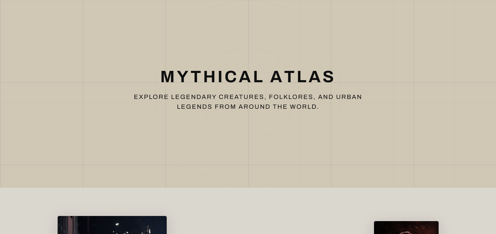
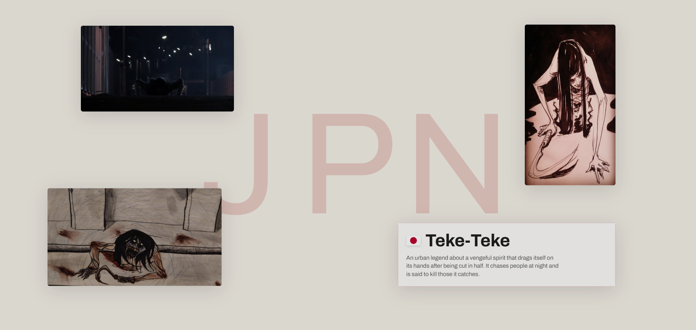
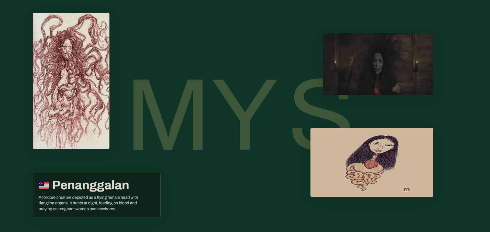

# Mythical Atlas

## Description

**Mythical Atlas** is an interactive frontend concept website developed to showcase modern web development techniques using **HTML, CSS, JavaScript, GSAP, ScrollTrigger, Lenis, and SplitText**. The project serves as a reusable scroll-driven storytelling template featuring dynamic theme transitions, multilingual text animations, responsive multimedia layouts, and smooth user interactions.

## Tech Stack

- HTML5
- CSS3
- JavaScript (ES6+)
- GSAP
- ScrollTrigger
- Lenis
- SplitText

## Notice

> **Desktop & Laptop Support Only**
>
> This project is currently optimized for **desktop and laptop** devices. Mobile and tablet responsiveness is planned and will be introduced in future updates.

